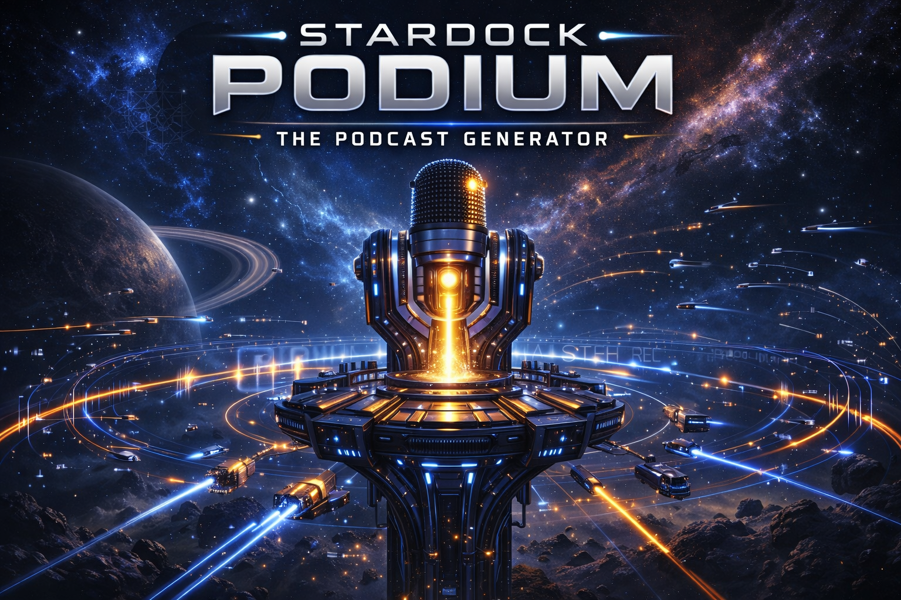

<p align="center">
  
</p>

# Stardock Podium (v4)

AI‑assisted **Star Trek–style** serialized podcast generator: reference
ingestion, episode structure (Save the Cat), scripts with continuity hooks,
**Kokoro** text‑to‑speech (GPU‑accelerated), and ffmpeg‑based mixing.

Full workflow: **`Docs/Docs_New/WORKFLOW.md`**. Optional later work:
**`Docs/Docs_New/BACKLOG.md`**. Detailed changelog below in
**[Devlog](#devlog--book-knowledge-ingest-and-kokoro-gpu-append-only)**.

---

## Quick start (Windows 10 / Linux)

The workflow below is the supported happy path after the P0 hardening PR.
Each step has a separate, more detailed section further down if you need it.

### 1. Install dependencies

```bash
pip install -r requirements.txt
```

**GPU users:** after the pip install, replace torch with a CUDA build —
see [PyTorch: GPU wheel](#pytorch-gpu-wheel-environment--fix-before-gpu-testing).

### 2. Kokoro weights (auto-downloaded by default)

Kokoro v0.9+ `KPipeline` auto-downloads the ~330 MB base weights from
HuggingFace on first use. For most local setups you don't need to do
anything.

If you want to pin weights to a specific location (shared across projects
or on a persistent cloud volume), set `KOKORO_MODEL_PATH` in `.env`:

```bash
# Example
KOKORO_MODEL_PATH=/abs/path/to/kokoro-tts-base-ft.pt

# Optional — persist the HuggingFace cache too:
HF_HOME=/abs/path/to/hf_cache
```

When `KOKORO_MODEL_PATH` is set and `HF_HOME` isn't, `tts_engine.py`
automatically redirects the HF cache to `<parent>/hf_cache/` so the
download lands on the same volume as your pinned weight file.

Non‑audio commands (`list-voices`, `missing-voices`, `ingest`,
`init-story-os`, `doctor`) work without the weights. Audio commands
(`generate-audio`, `register-voice`, `smoke-voice`) trigger the download
lazily on first call.

### 2a. Environment diagnostics

Run the doctor after install to verify GPU, API keys, paths, weights,
and FFmpeg are all in place:

```bash
python main.py doctor
```

Green checkmarks = ready to generate. Any red flag prints the exact fix.

### 3. Environment (`.env` in the project root)

Copy `.env.example` → `.env` and fill in keys. Path overrides below are
all optional — blank = relative paths under the repo root = local dev
mode.

| Variable | Required? | Purpose |
|---|---|---|
| `OPENAI_API_KEY` | **one of** these | Story LLM (GPT‑4o default) + Mem0 embedder |
| `OPENROUTER_API_KEY` | **or this** | Story LLM (Claude Opus 4.5 default) |
| `MEM0_API_KEY` | recommended | Managed Mem0 — skip local Qdrant requirement |
| `KOKORO_MODEL_PATH` | optional | Kokoro `.pt` location (e.g. `/workspace/models/kokoro-tts-base-ft.pt`) |
| `HF_HOME` | optional | HuggingFace cache dir (persist across pod restarts) |
| `STARDOCK_BOOKS_DIR` | optional | Override EPUB source dir |
| `STARDOCK_VOICES_DIR` | optional | Override voice registry + samples dir |
| `STARDOCK_EPISODES_DIR` | optional | Override generated script / audio dir |
| `STARDOCK_AUDIO_DIR` | optional | Override final MP3 output dir |
| `STARDOCK_DATA_DIR` | optional | Override bible / shows / sync_status root |
| `STARDOCK_ANALYSIS_DIR` | optional | Override style analysis output dir |
| `STARDOCK_TEMP_DIR` | optional | Override scratch dir |

`ELEVENLABS_API_KEY` is **no longer used** by the default pipeline.
The engine has been removed from `audio_pipeline`, `cli/generate_voices.py`
and `cli/validate_voices.py`; the class in `tts_engine.py` is kept for
backwards compatibility only and emits a `DeprecationWarning`.

### 4. Ingest reference books

```bash
# Drop EPUBs into  books/
python main.py ingest              # sync → extract bible → reload context
python main.py ingest --force      # force full re-sync + re-extract
```

Artifacts produced:

- `data/series/series_bible.json` — Tier 1 knowledge
- `data/series/style_profile.json` — voice / tone profile
- Mem0 entries for per‑scene RAG (Tier 2)

### 5. Register voices (new CLI workflow — `register-voice`)

The old "hand‑edit `voices/voice_config.json`" flow is still supported for
legacy installs, but the **recommended** flow is now the dedicated CLI. It
validates the WAV, writes `voices/registry.json`, and syncs
`voices/voice_config.json` for you.

Per‑character speaker WAV requirements:

- Mono, **16 kHz** sample rate, WAV container
- 6–15 s of clean speech (4–20 s accepted; `cli/validate_voices.py` warns
  outside the recommended window)

Typical loop for an episode:

```bash
# A. Create the episode & cast first (episode structure → characters)
python main.py generate --episode-number 1 --theme "first contact"
python main.py generate-characters <episode_id>

# B. See which WAVs you still need
python main.py missing-voices <episode_id>

# C. Drop each WAV under voices/samples/ and register it
python main.py register-voice "COMMANDER ZARA VOSS" voices/samples/commander_zara_voss.wav

# D. Smoke test before spending generation time on a full episode
python main.py smoke-voice "COMMANDER ZARA VOSS"

# E. Confirm everything is ready
python main.py missing-voices <episode_id>
# → "✅ All voices registered. Ready to generate audio."
```

Don't forget a **`narrator`** voice — it's used for the intro/outro
narration segments in `audio_pipeline`. Register it the same way:

```bash
python main.py register-voice "narrator" voices/samples/narrator.wav
```

Optional structural validation of the `voice_config.json` side of the
registry:

```bash
python cli/validate_voices.py --config voices/voice_config.json
```

### 6. Add SFX / music / ambience (optional but recommended)

- Sound effects: `assets/sound_effects/` (mp3 or wav; keyword‑matched)
- Ambience loops: `assets/ambience/`
- Theme music / intro / outro stingers: `assets/music/`

If any asset is missing at generation time, the pipeline writes a
manifest listing what it wanted:

```
episodes/<episode_id>/needed_audio_assets.json
```

Drop the missing files in, rerun `generate-audio`, and it will pick them up.

### 7. Generate the episode

```bash
# Full pipeline: scenes → script → QA → audio mix
python main.py generate-scenes <episode_id>
python main.py generate-script <episode_id>
python main.py generate-audio <episode_id>
```

Output: `episodes/<episode_id>/audio/<final_mix>.mp3` plus per‑scene mixes.

---

## Cloud Deployment (RunPod)

If your local machine can't handle sustained TTS generation, run Stardock
on a cloud GPU for roughly $0.10–$0.15 per episode. The codebase is
path-aware — every user-data directory is overridable via environment
variables so you can redirect everything onto a persistent network volume
and stop/start pods without losing state.

### Quick setup

1. Create an account at [runpod.io](https://runpod.io) and deposit $10.
2. Create a 50 GB **Network Volume** named `stardock-data` in a US region
   (US-OR / US-KS tend to have the most RTX 4090 inventory).
3. Launch a pod with an RTX 4090 and the official PyTorch template,
   attaching your volume at `/workspace`.
4. In the pod terminal:
   ```bash
   cd /workspace
   git clone https://github.com/enstest1/Stardock_Podium_v4.git
   cd Stardock_Podium_v4
   bash scripts/setup_runpod.sh
   nano .env                 # add API keys + path overrides
   python main.py doctor     # verify everything is healthy
   python main.py ingest     # one-time book extraction
   ```
5. Generate episodes as normal (`new-show`, `new-season`,
   `generate-episode`, `generate-audio`).
6. **Stop the pod when done** — running pods cost ~$0.35/hr, stopped pods
   cost $0 (you keep paying only ~$3.50/mo for the volume).

### Path overrides

The new `config.paths` module reads the following environment variables
(all optional — blank = relative paths = local dev mode):

| Env var | Default | Purpose |
|---|---|---|
| `KOKORO_MODEL_PATH` | `kokoro-tts-base-ft.pt` | Kokoro weights location |
| `HF_HOME` | *(unset)* | HuggingFace cache dir (persist on /workspace) |
| `STARDOCK_BOOKS_DIR` | `books` | Where EPUBs live |
| `STARDOCK_VOICES_DIR` | `voices` | Voice registry + samples |
| `STARDOCK_EPISODES_DIR` | `episodes` | Generated episode scripts |
| `STARDOCK_AUDIO_DIR` | `audio` | Exported MP3s |
| `STARDOCK_DATA_DIR` | `data` | Bible / state / sync status |
| `STARDOCK_ANALYSIS_DIR` | `analysis` | Style analysis results |
| `STARDOCK_TEMP_DIR` | `temp` | Scratch (keep local on pod) |

See `.env.example` for a ready-to-paste RunPod block.

### Cost estimate

| Usage | Per Episode | Per Month (8 eps) |
|---|---|---|
| Pod time | ~$0.10 | ~$0.80 |
| Storage  | —      | ~$3.50 |
| **Total** | **~$0.10** | **~$4.30** |

See `scripts/setup_runpod.sh` for the automated first-time setup script.

---

## Creating a Show (3‑Level Prompt System)

Stardock Podium treats each podcast like a TV show — not a sequence of disconnected
episodes. There are three levels of prompts:

### Level 1 — The Show (once per podcast)

Define the premise, tone, and permanent cast. This is the foundation that shapes
every episode forever.

```bash
python main.py new-show \
  --name "Prophets and Gamma" \
  --concept "A Star Trek podcast set in the Bajoran sector, focused on
             spiritual mysteries and first contact with Dominion-era threats.
             Ensemble cast with Starfleet, Bajoran religious, and civilian perspectives."
```

The system reads your ingested books + your concept, proposes a cast size and
composition, and lets you confirm or adjust. The main cast is then locked in
`data/shows/<show_id>/series_bible.json` and appears in every episode.

### Level 2 — The Season (optional, once per season)

Plan a season‑long arc that gives episodes cohesion.

```bash
python main.py new-season \
  --show prophets_and_gamma \
  --season 1 \
  --arc "The crew discovers the Temple of the Prophets while Dominion expansion
         threatens the sector. Season ends with first official Dominion contact." \
  --episodes 10
```

The system breaks the arc into per‑episode milestones so each episode serves the
season. Some episodes are arc‑central, others are "breather" character episodes.

### Level 3 — The Episode (optional, per episode)

Nudge a specific episode's direction.

```bash
python main.py generate-episode --theme "Chief Engineer is abducted by Jem'Hadar"
```

If no `--theme` is given, the system uses the season arc slot for this episode
number. If no season is planned, it generates a standalone episode.

### Commands Summary

```bash
python main.py new-show      # create show (Level 1)
python main.py new-season    # plan season (Level 2)
python main.py list-shows    # see all shows
python main.py generate-episode --theme "..."  # Level 3 override
```

---

## Architecture highlights

| Area | Location |
|------|-----------|
| Story + Save the Cat | `story_structure.py` |
| Book knowledge (bible / style / RAG) | `book_knowledge.py` |
| Episode memory / continuity | `episode_memory.py` |
| Kokoro dialogue (shared) | `dialogue_engine.py`, `tts_engine.py` |
| Episode mix | `audio_pipeline.py` |
| Voice registry (Kokoro‑only) | `voice_registry.py` |
| Show OS (new‑show, season arcs) | `show_os/` |
| Story OS (planner, state, RAG, context) | `story_os/` |
| Asyncio compatibility (nested‑loop safe) | `story_os/asyncio_compat.py` |
| Feature flags | `data/feature_flags.json` + env |
| Agentic script (plan → script → QA) | `story_pipeline_agent.py` |
| Director / pins / drafts / trace / export | `director_pass.py`, `draft_store.py`, `generation_trace.py`, `export_timeline.py` |
| Post‑mix audio QA (optional) | `audio_qa.py` |
| Stable script line ids | `script_line_ids.py` |
| Centralized path config (local / cloud) | `config/paths.py` |
| RunPod bootstrap script | `scripts/setup_runpod.sh` |

## What is not versioned

Generated data (`books/`, `episodes/`, `analysis/`, `temp/`, large media,
`voices/models/*.pt`, `voices/samples/*.wav`) is ignored by git; see
`.gitignore`.

## Legacy / deprecated engines

- **Coqui TTS** — removed from `tts_engine` in favor of Kokoro. Some docs
  under `Docs/` may still mention it.
- **ElevenLabs** — fully removed from the default pipeline
  (`audio_pipeline.py`, `cli/generate_voices.py`, `cli/validate_voices.py`).
  The `ElevenLabsEngine` class in `tts_engine.py` is retained only for
  legacy scripts and raises a `DeprecationWarning` on instantiation. The
  `ELEVENLABS_API_KEY` env var is ignored by every current code path.

## Troubleshooting

| Symptom | Fix |
|---|---|
| Kokoro weights not found | Either let `KPipeline` auto-download on first use, or pin a path via `KOKORO_MODEL_PATH` in `.env`. See step 2 above. |
| Everything looks broken on a fresh machine | Run `python main.py doctor` — surfaces missing API keys, CPU-only torch, missing FFmpeg, missing series bible, and empty data dirs in one pass. |
| Data vanished after pod restart on RunPod | Pod storage is ephemeral outside `/workspace`. Make sure your `.env` has the `STARDOCK_*_DIR` overrides pointing under `/workspace/Stardock_Podium_v4/…`. See [Cloud Deployment (RunPod)](#cloud-deployment-runpod). |
| `torch.cuda.is_available()` is `False` on a GPU box | You have the CPU wheel. Reinstall per [PyTorch: GPU wheel](#pytorch-gpu-wheel-environment--fix-before-gpu-testing). |
| `Ready: False` from `get_knowledge_context()` | Run `python main.py ingest` (and drop EPUBs in `books/` first). |
| `missing-voices` says characters are unregistered after you edited `voice_config.json` by hand | Prefer `register-voice`. The legacy hand‑edit path doesn't update `voices/registry.json`. |
| `RuntimeError: asyncio.run() cannot be called from a running event loop` | Shouldn't happen anymore — both call sites use `story_os.asyncio_compat.run_coro`. If you see it in new code, wrap your call the same way. |
| Silent failure or odd completions from OpenRouter | Check the model slug is still live; current default is `anthropic/claude-opus-4.5`. Slugs change. |

Known deferred work (tracked for P1 follow‑up):

- Two sources of truth for voices — `voices/registry.json` and
  `voices/voice_config.json` both exist; registration keeps them in sync
  but **manual** edits do not. Prefer the CLI.
- Model slugs are duplicated across `story_structure.py`, `book_knowledge.py`,
  `quality_checker.py`, `script_editor.py`, `mem0_client.py`. If OpenRouter
  deprecates a slug you'll grep‑and‑replace in several files until a single
  `MODELS` dict is introduced.
- `audio_pipeline.role_to_character` is hard‑coded to legacy character
  names and should be deleted or driven from the registry.

---

## Devlog — book knowledge, ingest, and Kokoro GPU (append-only)

This section records **recent upgrades** without replacing the material
above. Treat it as a living changelog until docs are consolidated.

### What changed (summary)

1. **`tts_engine.py` — Kokoro device**  
   Kokoro selects **CUDA when available**, otherwise CPU, with clear logging.
   **`requirements.txt` uses `torch>=2.2.0`** so a plain `pip install -r` no
   longer pins the old **`+cpu`** wheel. On a GPU box you still need a
   **CUDA-enabled** torch build (see below)—that is the main real-world
   blocker before Kokoro can use the GPU.

2. **`book_knowledge.py` — three-tier knowledge**  
   - **Tier 1:** Series bible + style profile (JSON on disk), injected into
     key LLM **system** prompts (character cast + scene scripts).  
   - **Tier 2:** Per-scene **RAG** from Mem0—up to six chunks, **no 500-char
     truncation** in scene outlines.  
   - **Tier 3:** Raw books stay on disk / in Mem0; only used during extract.

3. **`story_structure.py`**  
   Loads `KnowledgeContext` at init; uses `get_rag_context()` instead of ad
   hoc `search_references` for scene generation; bible/style appended via
   `build_system_prompt()`. **`search_references` is not imported or called
   here**—if a future edit reintroduces it without an import, you get a
   `NameError` at runtime. Quick check:  
   `grep -n "search_references" story_structure.py` → **no matches** (expected).

4. **`reference_memory_sync.py`**  
   After a **full multi-book sync**, optionally runs **series bible
   extraction** and reloads knowledge. `sync_references(..., force_bible=True)`
   can force re-extraction after a **single-book** sync.

5. **`main.py`**  
   - Ensures **`data/series`** and **`data/sync_status`** exist.  
   - **`python main.py ingest`** runs sync → bible extract → reload context.  
   - Environment check expects **`torch`** (for GPU path) and **Kokoro**;
     **ElevenLabs is not** a required module for the default pipeline.

6. **`book_knowledge.py` — OpenRouter model id**  
   Bible extraction uses the same **Claude Opus** slug as the rest of the app
   (**`anthropic/claude-opus-4.5`**). A typo like **`opus-4-5`** can fail
   quietly on OpenRouter (error or unintended fallback). Keep this aligned
   with `story_structure.py` if you change models.

### Kokoro weights (required — fix before first audio run)

Kokoro needs a local weights file. Previously `tts_engine.py` expected the
file at the working directory with **no existence check**, which made first
runs crash deep inside Kokoro. The loader now searches, in order:

1. `$KOKORO_MODEL_PATH` (if set — absolute path to the `.pt` file)
2. `voices/models/kokoro-tts-base-ft.pt` (canonical location)
3. `./kokoro-tts-base-ft.pt` (legacy CWD — still supported)

If none exist, you get a one‑screen error with the resolved paths and the
download hint.

**Setup** (one‑time):

```bash
mkdir -p voices/models
# Download the base weights (~300 MB) from Kokoro's official release page:
#   https://huggingface.co/hexgrad/Kokoro-TTS
# Save the .pt as:
#   voices/models/kokoro-tts-base-ft.pt
```

You can also put the file anywhere and point `KOKORO_MODEL_PATH` at it in
your `.env` (e.g. if you share weights across projects).

### P0 hardening (fresh‑clone safety — applied)

The following changes make a clean clone runnable even without the full
audio stack installed:

- **`tts_engine.py`** — Kokoro weights path is resolved with a real
  existence check and a download hint on miss; no more cryptic stack traces.
- **`main.py`** — required modules are split into `REQUIRED_CORE`
  (`mem0`, `openai`, `nltk`, `ebooklib`) and `OPTIONAL_AUDIO`
  (`ffmpeg`, `torch`, `kokoro`). Audio deps are **warned** at startup and
  **enforced lazily** via `require_audio_stack()` only when an audio
  command is actually invoked. Non‑audio commands (`list-voices`,
  `missing-voices`, `ingest`, `init-story-os`) now run on a box with no
  Kokoro/ffmpeg.
- **`python main.py ingest`** short‑circuits **before** voice registry
  initialisation, so a fresh repo can ingest books without any voices
  registered.
- **`cli/generate_voices.py` / `cli/validate_voices.py`** — ElevenLabs
  fallback removed. Kokoro‑only. Validator widens the WAV duration rule to
  4–20 s (hard) with a 6–15 s recommended soft‑warn.
- **`story_os/asyncio_compat.run_coro`** — wraps the two `asyncio.run`
  call sites (`cli_entrypoint.cmd_generate_scenes`, `script_editor`
  auto‑generate path) so the CLI no longer deadlocks when driven from an
  already‑running event loop (Jupyter, pytest‑asyncio, future agentic
  wrapper).

### PyTorch: GPU wheel (environment — fix before GPU testing)

This is **not a code bug**: if PyTorch is the **CPU** build, `torch.cuda` is
never available and Kokoro stays on CPU. **Uninstall CPU torch first**, then
install a **CUDA** build (example: **CUDA 12.1** index; **11.8** is also fine
for many RTX cards):

```bash
pip uninstall -y torch torchvision torchaudio
pip install torch torchvision torchaudio --index-url https://download.pytorch.org/whl/cu121
```

Verify:

```bash
python -c "import torch; print(torch.cuda.is_available(), torch.cuda.get_device_name(0) if torch.cuda.is_available() else 'cpu')"
# Expect: True  NVIDIA GeForce RTX …
```

If you only need **CPU** (slow Kokoro), a CPU-only torch from PyTorch’s docs
is fine—skip the CUDA index.

### Smoke tests (imports; beyond `py_compile`)

`python -m py_compile` checks syntax only. These catch missing imports and
many init failures:

```bash
python -c "from book_knowledge import get_knowledge_context; ctx = get_knowledge_context(); print('Ready:', ctx.is_ready())"
python -c "from dotenv import load_dotenv; load_dotenv(); from story_structure import StoryStructure; StoryStructure(); print('OK')"
```

The **`StoryStructure`** line needs the **same env as the app** (Mem0’s
embedder uses **`OPENAI_API_KEY`** unless your `mem0` config says otherwise).
If it errors on Mem0 init, load `.env` first (as above) or export keys in the
shell—this is expected in a bare CI shell with no secrets.

### How it works now (data flow)

1. Put EPUBs under **`books/`**.  
2. Run **`python main.py ingest`** (or sync via your usual CLI path). Books
   go to Mem0; then **`SeriesBibleExtractor`** builds  
   `data/series/series_bible.json` and `data/series/style_profile.json`.  
3. **`StoryStructure`** loads that context once; every relevant generation
   call gets Tier 1 in the system message and Tier 2 in the user prompt where
   RAG is used.  
4. If ingest was skipped, generation still runs, but you’ll see warnings about
   missing book knowledge.

### How to run it (commands)

The end‑to‑end happy path has moved to the
[Quick start](#quick-start-windows-10--linux) at the top. This section
only records the GPU‑first ordering for clarity:

1. Fix PyTorch (CUDA wheel) — see above.
2. Verify GPU — `torch.cuda.is_available()` and device name.
3. Download Kokoro weights to `voices/models/kokoro-tts-base-ft.pt`.
4. Put EPUBs in `books/`.
5. `python main.py ingest` — watch for **KnowledgeContext** / bible + style
   lines and, on GPU, **Kokoro using GPU: …**.
6. Register voices (`register-voice`, `smoke-voice`, `missing-voices`).
7. Generate: `generate` → `generate-characters` → `generate-scenes` →
   `generate-script` → `generate-audio`.

### Files to skim for implementation detail

| Topic | File |
|-------|------|
| Tier 1–2 logic, extractors | `book_knowledge.py` |
| Prompt wiring | `story_structure.py` |
| Post‑sync bible hook | `reference_memory_sync.py` |
| Ingest shortcut + dirs + env split | `main.py` |
| Kokoro CUDA/CPU + weights resolver | `tts_engine.py` |
| Kokoro‑only voice registry + CLI | `voice_registry.py`, `cli_entrypoint.py` |
| Nested‑loop‑safe coroutine runner | `story_os/asyncio_compat.py` |

---

### Cloud-ready upgrade — RunPod / persistent volume support (2026‑04‑19)

**Problem.** Local CPU generation was too slow for sustained TTS work, and
the repo assumed everything lived under the project root on a single
machine. Moving to RunPod needed the code to be path-aware so user data
could live on a persistent `/workspace` volume while ephemeral pod
storage got wiped between sessions.

**What changed.**

1. **New `config/paths.py`** — single source of truth for every
   user-data directory. Reads `STARDOCK_BOOKS_DIR`, `STARDOCK_VOICES_DIR`,
   `STARDOCK_EPISODES_DIR`, `STARDOCK_AUDIO_DIR`, `STARDOCK_DATA_DIR`,
   `STARDOCK_ANALYSIS_DIR`, `STARDOCK_TEMP_DIR`. Falls back to relative
   paths so local dev keeps working with zero env vars set. Exposes
   `ensure_all_dirs()` for a single init call.

2. **`tts_engine.py` — `KOKORO_MODEL_PATH` aware.**
   `KokoroEngine.__init__` reads `KOKORO_MODEL_PATH` if set, logs whether
   the file is present, and when `HF_HOME` isn't set **redirects the
   HuggingFace cache to `<parent>/hf_cache/`** so the Kokoro download
   (via `KPipeline`) lands on the same persistent volume as the pinned
   weight file. Auto-download still works transparently — nothing breaks
   if `KOKORO_MODEL_PATH` is unset.

3. **New `doctor` CLI command.** `python main.py doctor` runs a
   one-screen diagnostic: Python version, GPU + VRAM, OpenAI /
   OpenRouter / Mem0 / optional ElevenLabs keys, Kokoro weights, every
   path from `config.paths` (with EPUB and WAV sample counts), series
   bible presence, and FFmpeg on PATH. Exits non-zero when anything
   critical is missing.

4. **`main.py` / `cli_entrypoint.py`** — both `create_default_directories`
   helpers now delegate to `ensure_all_dirs()` so overrides propagate
   everywhere.

5. **Modules updated to use `config.paths`:** `book_knowledge.py`
   (`SERIES_DIR`), `voice_registry.py` (`VOICES_DIR`, `VOICE_SAMPLES_DIR`),
   `reference_memory_sync.py` (`SYNC_STATUS_DIR`), `audio_pipeline.py`
   (`EPISODES_DIR`, `VOICES_DIR`), `story_structure.py` (`SHOWS_DIR` ×3),
   `show_os/new_show.py` + `show_os/seasons.py` (`SHOWS_DIR`),
   `story_os/io.py` (`SERIES_DIR`), `episode_memory.py` (`EPISODES_DIR`),
   `draft_store.py` + `export_timeline.py` (`EPISODES_DIR`),
   `epub_processor.py` (`BOOKS_DIR`, `ANALYSIS_DIR`).

6. **`.env.example` rewritten** — required keys at top, fully
   commented-out RunPod override block at the bottom. Safe to `cp` on a
   fresh machine.

7. **New `scripts/setup_runpod.sh`** — idempotent first-time pod
   bootstrap. Installs FFmpeg + Python deps, downloads Kokoro weights to
   `/workspace/models/` on the persistent volume, symlinks them into the
   repo root (legacy-safe), creates `/workspace/Stardock_Podium_v4/…`
   data dirs, seeds `.env` from the template, and prints the exact env
   block to paste into `.env`. Executable (`chmod +x`).

8. **README Cloud Deployment section** — quick-setup, env var table,
   cost estimate, per-episode + monthly numbers. See
   [Cloud Deployment (RunPod)](#cloud-deployment-runpod) above.

**Backwards compatibility.** Every env var is optional. A clone with an
empty `.env` (except the API keys) behaves exactly the same as before —
relative paths, repo-root storage. No CLI flags changed. No import
changes in user-facing code beyond the internal additions.

**Verification.**

- `from config.paths import *; ensure_all_dirs()` runs clean.
- `python main.py doctor` on the dev laptop shows all green **except**
  `GPU NOT AVAILABLE` (expected — CPU-only box, and precisely the
  reason for the cloud migration).
- No new lint errors across the ~17 touched files.
- Existing episode `ep_7ba65dfe` (Episode 1, 184 dialogue lines, 19
  speakers, all resolving) is unchanged — the script + voice configs
  from the previous session are fully compatible with the new path
  layer.

**How to resume the killed audio render on RunPod.**

```bash
# After bash scripts/setup_runpod.sh and editing .env:
python main.py doctor
# Upload episodes/ep_7ba65dfe/ + voices/ to the pod volume, then:
python cli_entrypoint.py generate-audio ep_7ba65dfe --quality high
```

**Deferred for a future pass.**

- `tests/test_needed_audio_report.py` still constructs
  `Path('episodes')` directly in its fixture. It works because the test
  passes the path in explicitly — no real breakage, just a style
  inconsistency if STARDOCK_EPISODES_DIR is ever set during CI.
- `ingest_all.py` and a couple of `cli/` scripts still have hardcoded
  `"books"` / `"episodes"` string literals. They're thin wrappers; the
  modules they call already honor the config, so the practical blast
  radius is zero, but they should be tidied in the next sweep.
- `book_style_analysis.py` was not touched (deprecated path).
